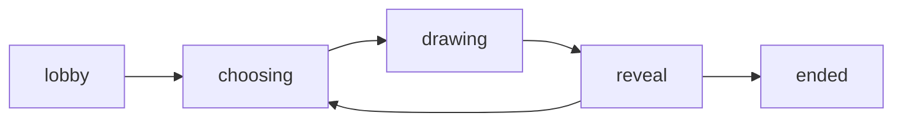

Squiggle is a real-time multiplayer draw and guess game. One player draws a word while everyone else races to guess it. Players take turns drawing across multiple rounds, and the player with the most points at the end wins.

## Game phases

Every game moves through five phases in sequence. The `Phase` type in `lib/types.ts` defines all five:

```typescript
type Phase = 'lobby' | 'choosing' | 'drawing' | 'reveal' | 'ended';
```

<CardGroup cols={2}>
  <Card title="Lobby" icon="users">
    Players join and wait. The host configures room settings (rounds, draw time, categories, etc.) and starts the game when ready. At least 2 players are required.
  </Card>
  <Card title="Choosing" icon="list">
    The current drawer sees N word choices (configurable, default 3) and picks one. Other players see a waiting message. This phase has a 15-second timer — if the drawer doesn't choose, the first word is selected automatically.
  </Card>
  <Card title="Drawing" icon="pen-line">
    The drawer draws on the shared canvas while others type guesses in chat. Hints reveal letters over time. The phase ends when time runs out, everyone guesses correctly, or a majority votes to skip.
  </Card>
  <Card title="Reveal" icon="eye">
    The secret word is shown to all players for 5 seconds. Points earned this round are visible on the player strip. Then the next turn begins automatically.
  </Card>
  <Card title="Ended" icon="trophy">
    All rounds are complete. Final scores are displayed with gold, silver, and bronze medals for the top three players. The host can start a new game or players can leave.
  </Card>
</CardGroup>

## Phase flow



After `reveal`, the game either advances to the next turn (`choosing` phase for the next drawer) or transitions to `ended` if all rounds are complete.

## Turn order

When the host starts a game, all connected players are shuffled into a fixed turn order stored as `turnOrder` on the room document. This order does not change during the game.

- Each turn, the drawer advances one position in `turnOrder`.
- When the last player in `turnOrder` has drawn, the round number increments and the sequence restarts from the beginning.
- If a player disconnects, their slot is skipped and the remaining players continue in the same order.

## Rounds

A round is one full pass through `turnOrder` — every player draws once. The number of rounds is configurable (default: **3**, range: 1–10).

The current round number is tracked in `currentRound.roundNumber` on the room document.

## Win condition

The game ends when all rounds are complete. The player with the highest `score` wins. Scores are sorted descending on the final leaderboard. Ties are broken by the order scores were last updated.
